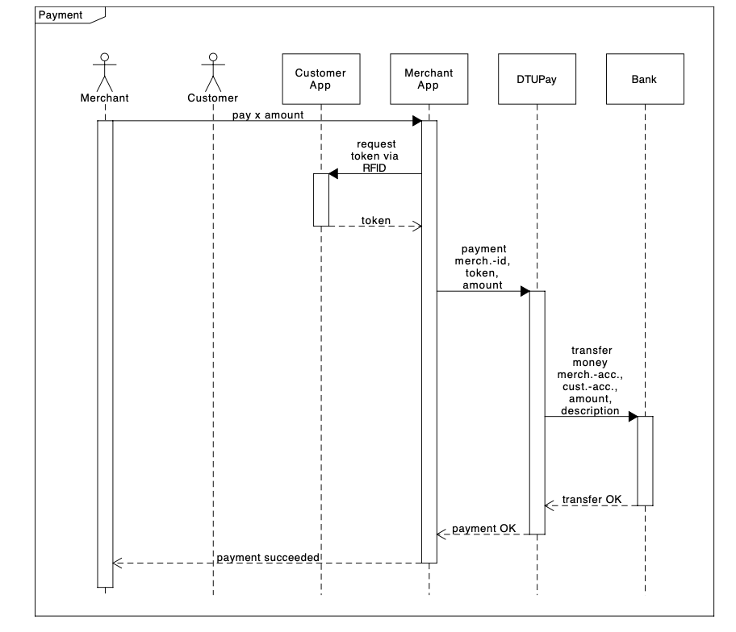

# DTU-Pay

**DTU Pay** is a company that offers a mobile payment option for shop owners (i.e. merchants) and customers. Both, customer and merchant, already have a bank account with the bank (the bank is supplied by SOAP). To use the service, both, customers and merchants have to be registered with DTU Pay with their bank account id’s / account numbers.

## Team 

|  Name | Email  | 
|---|---|
|  De Santos Bernal Verconica | s210098@dtu.dk  |
|  Hejlsberg Jacob Kølbjerg |  s194618@dtu.dk |
|  Karavasilis Nikolaos | s213685@dtu.dk  |
|Laforce Erik Aske|s194620@dtu.dk|
|Siskou Melina|s213158@dtu.dk|
|Spyrou Thomas|s213161@dtu.dk|

Table of Contents
-----------------
* [Implemention](#Implemention)
* [Architecture](#Architecture)
* [Requirements](#Requirements)
* [Build And Run](#Build-And-Run)
* [Testing](#Testing)
* [Documentation](#Documentation)

## Implemention
DTU Pay is implemented using a microservice architecture using docker containers. The communication among the *microservices* is handled thought **RabbitMq**. The communication to the outside uses **REST** and **SOAP** (to the bank). The resulting applications have associated tests with a high code coverage, and business logic tested using **Cucumber** scenarios. 


**Jenkins** was used and thus served as an important part of our agile workflow throughout this project as well as making **CI/CD** possible. The purpose of jenkins was to insure stability of each microservice and the entire DTUPAY application. 


The implemantion of DTU-Pay supports the following functionalities through different REST interfaces:
- Registration of merchants and customers.
- Payment,which includes transferring money from the account that the customer has in the bank to the account of the merchant in the bank.
- Fetching payment reports to the manager, merchant and customer. However, the payment reports differ based on the role that requests the information, e.g. the manager should be aple to see all of the payments.

The figure below @fig:payment depicts the payment process. It is assumed that the customer and the merchant are already registered with DTU Pay and that the customer has obtained at least one token.

{#fig:payment}

## Architecture 

The customer and the merchant both are using a mobile device to interact with DTU Pay. DTU Pay offers three distinct REST interfaces. One for the customer, merchant, and manager. The customer and merchant apps over each an API to access the corresponding ports of DTU Pay. Both, the customer and the merchant API’s, are used by the automated system tests to test the functionality of the whole system.
Here is an example of the test scenario for successful payment in pseudo code. Here, CustomerAPI and MerchantAPI are classes inside the test client that represent the API’s used in the merchant and customer apps to access the REST interface of DTUPay.

```
customerAccount = bank.createAccount Name, CPR, balance
merchantAccount = bank.createAccount Name, CPR, balance
cid = customerAPI.register Name, customerAccount, ...
                  this will register the customer via the customer port of DTU Pay
mid = merchantAPI.register Name, merchantAccount, ...
                  this will register the merchant via the merchant port of DTU Pay
tokens = customerAPI.getTokens 5, cid
                  this will get 5 tokens via the customer port of DTU Pay
token = select a token from tokens
merchantAPI.pay token, mid, amount
                  this will execute the payment via the merchant port of DTU Pay
                  and in DTU Pay, this will cause a call the money transfer service
                      of the bank
customerBalance = bank.getBalance customer account
merchantBalance = bank.getBalance merchant account
check that customerBalance and merchantBlance are correct
bank.retire customer account
bank.retire merchant account
```

The architecture otherview is shown in the figure below. The green parts are the components that make up the business logic. The red parts belong to the end-to-end tests.

{#fig:architecture}

## Requirements

You need to have downloaded maven in order to build and run the webservices. Apache-maven version 3.8.4 which it is known to work with can be downloaded from https://maven.apache.org/download.cgi. And java jdk 11 is also needed and can be found at https://www.oracle.com/java/technologies/javase/jdk11-archive-downloads.html


## Build And Run
To test, build and run the application simply run the build-and-run.sh script file. This will call build.sh and start.sh. build.sh builds images of all services and start.sh launches them in docker containers. Build-and-run.sh calls these scripts in order. Once the images has been tested and built once the start.sh can be used to launch the application. This will expose the facade through localhost on port 8080.
```
./build_and_run.sh
```
>**Note** The Bank might stop being maintained by DTU.

## Testing
To run the tests for the microservices (All projects except integrationTest) navi- gate to the folder for the repository eg. Reporting and then to the service folder eg. reporting-service (this is the repository name - service). In here there will be a build script this will run the tests and build an image. If you only wish to run the tests in the same path you can use the mvn test command.

```
                            == Test Script == 
#!/bin/bash
cd DTUPay -Payment/payment -service ./build.sh

OR

mvn test
```

## Documentation
The ```./documentation``` folder contains the following reports:

- **WebServiceGroup21:** Complete description of the implementation including how we took advantage of the DomainDrivenDesign (DDD) approach as well as a thorough analysis of the hexagonal architecture of our system.
- **swaggerGroup21:** A swagger file for each REST API implemented.
- **UsersGuideGroup21:** A user guide that  describes the miscellaneous use cases of our DTUPay implementation. 

